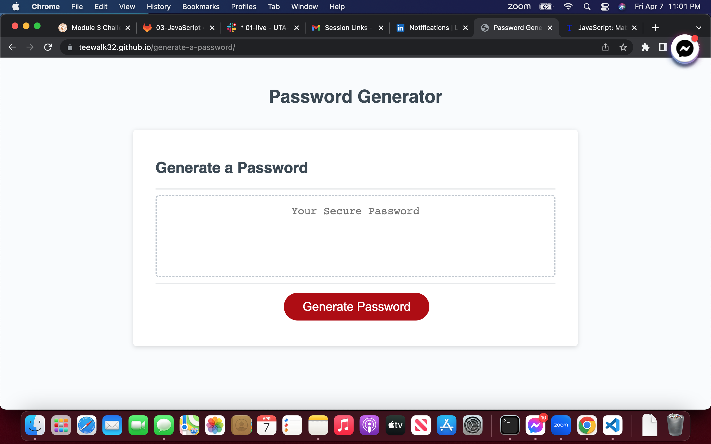

# generate-a-password

## Description

I was really motivated to learn JavaScript and that was my drive to complete this project. This project was built so I could become familar with how to write JavaScript code and use this as my platform to progessivly learn more about how to code this language. I learned about alot about JavaScript and was able to put some of what I learned in this project.

## Installation

N/A

## Usage

When eneterimg this webpage click the generate password button and it'll be followed by a prompt and a few confirms. After you confirm what characters you want in your password it'll display one for you on the screen. Follow link at the end of this repository and the webpage will look like this.

## Credits

N/A

## Webpage 

https://teewalk32.github.io/generate-a-password/